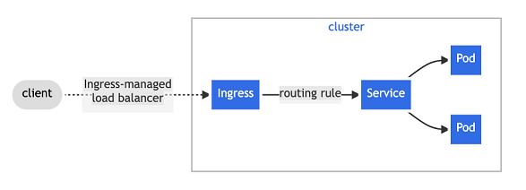
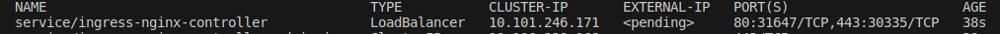
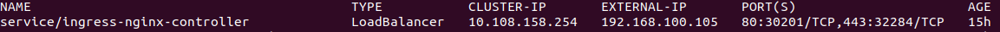

# NGINX Ingress Controller Setup (with Helm)

The standard way of exposing applications that are running on a set of Pods in a Kubernetes Cluster is by using service resource. Each Pod in Kubernetes has its own IP address, but a set of Pods can have a single DNS name. Kubernetes is able to load-balance traffic across the Pods without any modification in the application layer. A service, by default is assigned an IP address (sometimes called the “cluster IP“), which is used by the Service proxies. A Service is able to identify a set of Pods using label selectors.
<br/><br/>
Before explaining what is an Ingress Controller, we have to understand an Ingress Object in Kubernetes. From the [official Kubernetes documentation](https://kubernetes.io/docs/concepts/services-networking/ingress/), an Ingress is defined as "An API object that manages external access to the services in a cluster, typically HTTP. Ingress may provide load balancing, SSL termination and name-based virtual hosting.".<br/>
An Ingress in Kubernetes exposes HTTP and HTTPS routes from outside the cluster to services running within the cluster. All the traffic routing is controlled by rules defined on the Ingress resource. An Ingress may be configured to: provide services with externally-reachable URLs / to load  balance traffic coming into cluster services / to terminate SSL TLS traffic / to provide name-based virtual hosting in Kubernetes.<br/>
An Ingress controller is what fulfils the Ingress, usually with a load balancer. Basically, it works to enact the rules you have set, usually using an HTTP or L7 load balancer. It ensures that your inputs to the Ingress Resource are followed consistently.<br/><br/>
Below is an example on how an Ingress sends all the client traffic to a Service in Kubernetes Cluster.</br>

<br/>
For the standard HTTP and HTTPS traffic, an Ingress Controller will be configured to listen on ports 80 and 443. It should bind to an IP address from which the cluster will receive traffic from. A Wildcard DNS record for the domain used for Ingress routes will point to the IP address(s) that Ingress controller listens on.<br/>
 You can choose from the [plenty of Ingress Controllers](https://kubernetes.io/docs/concepts/services-networking/ingress-controllers/) available. Here, we will be using the [NGINX one from Kubernetes](https://github.com/kubernetes/ingress-nginx/).
## Before you begin
With all these basics on Kubernetes Services and Ingress, we can now plunge into the actual installation of NGINX Ingress Controller Kubernetes. There are 2 major deployment options:
* Without Helm: 
Using this method, you’ll manually download and run deployment manifests using kubectl command line tool.
* With Helm:
Using this method, you'll be using the project repository charts.
<br/><br/>The Helm method will be the method that I chose to use and explain here.<br/><br/>
If you do not have Helm installed, you will need to install it. 
For this, you can follow the 'Installing Helm' section from my [Helm documentation repository](https://github.com/hereishd/k8s_Tutorials/tree/main/Helm) or the documentation from the [original Helm website](https://helm.sh/docs/intro/install/).
## Deploying the NGINX Controller
* Get the NGINX installation repository
```
$ helm repo add ingress-nginx https://kubernetes.github.io/ingress-nginx
$ helm repo update
```
* Get the desired verison
```
helm search repo ingress-nginx --versions
```
*Refer to the supported versions table in [the official documentation](https://github.com/kubernetes/ingress-nginx/) to select the version that matches your compatibility matrix.*
* Set your desired version
```
$ export CHART_VERSION="<Adequate version from previous step>"
```
* Create the namespace
```
$ kubectl create namespace ingress-nginx
```
* Install the NGINX Controller from the Helm Repo
```
$ helm install ingress-nginx ingress-nginx \
  --repo https://kubernetes.github.io/ingress-nginx \
  --version ${CHART_VERSION} \
  --namespace ingress-nginx
```
* Check the installation
```
$ kubectl get all --namespace ingress-nginx
```
* Get the Chart Values file (Optional)
<br/>In case you would like to change some values from the original chart values before or after deploying it, you can save the value file.
```
$ helm show values ingress-nginx --repo https://kubernetes.github.io/ingress-nginx > ingress-values.yaml
```
&nbsp;Then, after making the desired changes to it, you can pass it to your deployment
```
$ helm upgrade -i ingress-nginx -n ingress-nginx ingress-nginx -f ingress-values.yaml --repo https://kubernetes.github.io/ingress-nginx
```

## Configure the NGINX Ingress Controller
If you now take a look at your Ingress Controller service
```
$ kubectl get svc -n ingress-nginx
```
You will realise that the EXTERNAL_IP of this service is pending.<br/>
<br/>
This means not assigned. The reason being we do not have a LoadBalancer in our cluster. So let's fix this.<br/>

When you deploy Kubernetes Cluster in a Public Cloud environment, the network load balancers are available on-demand. The same is not true for clusters deployed in private cloud environment or any kind of on-prem Infrastructure. In this kind of setups it’s the responsibility of System Administrators / Network Engineers to integrate Kubernetes Cluster with any Load balancer(s) in place.<br/>
A Load balancer is responsible for the provision of a single IP address to route incoming requests to the application. For you to successfully create Kubernetes services of type LoadBalancer, a load balancer implementation available for Kubernetes is required.<br/>
Note that for the external connectivity method, we have two major options:
* Using a Load Balancer (Highly recommended)
* Using Specific Nodes to run Nginx Ingress Pods (NOT recommended)<br/>
This is not a recommended implementation and I will possibly document it in the future to serve as reference documentation.
<br/><br/>
So here, we are going to make use of the Load Balancer. The Load balancer is used to expose an application running in Kubernetes cluster to the external network. It provides a single IP address to route incoming requests to Ingress controller application. In order to successfully create Kubernetes services of type LoadBalancer, you need to have the load balancer implementation inside / or outside Kubernetes.<br/>
When a service is deployed in cloud environment, Load Balancer will be available to your service by default. Ingress service should get the LB IP address automatically. But for Baremetal installations you’ll need to deploy a Load Balancer implementation for Kubernetes. I have found multiple articles recommending to use MetalLB as internal Load Balancer for a Bare Metal cluster installation.<br/><br/>
Here, you can find my doc explaining how to install and use MetalLB as internal LoadBalancer.
* [Deploying MetalLB as internal Load Balancer](MetalLB-Load-Balancer/readme.md)
<br/><br/>
Later on, I will be documenting a method for implementing an external LoadBalancer using NGINX.
* [Deploy NGINX as external Load Balancer](Nginx-Load-Balancer/readme.md)
## Set NGINX Ingress to use the Load Balancer
* Check the NGINX Ingress Service
```
$ kubectl get svc -n ingress-nginx
```
* In case your svc is of type NodePort, Patch the ingress-nginx-controller service by setting it's type to LoadBalancer
In case your ingress-controller service is of type NodePort, you need to set it to LoadBalancer.
```
$ kubectl -n ingress-nginx patch svc ingress-nginx-controller --type='json' -p '[{"op":"replace","path":"/spec/type","value":"LoadBalancer"}]'
```
Your Ingress Controller's EXTERNAL_IP should no longer be in 'pending' state and now have been assigned an IP.<br/>


## Mapping DNS name for Nginx Ingresses to LB IP
Since I am working with VirtualBox and a cluster made from VM's, we need to map our dns to our IPs. As we can see in our [sample ingress file](https://github.com/hereishd/K8S-From-Scratch/blob/main/Nginx-Ingress-Controller/sample-webapp/sample-ingress.yaml) we will be using for the demo, we need to declare a host. This host's dns needs to be mapped in our hosts file so our system can resolve it.
* Edit the hosts file
```
$ sudo nano /etc/hosts
``` 
Here you add your ingress controller's EXTERNAL_IP and map it to the domain of your choice. I chose ```cluster1.homelab.com```.

## Deploy Services to test Nginx Ingress functionality 
It is now time to deploy a sample webapp and create an Ingress Resource to test our setup.<br/>
First, let's deploy a web app with a service of type ClusterIP to expose it inside our cluster.<br/> 
I have provided a [sample web app](https://github.com/hereishd/K8S-From-Scratch/blob/main/Nginx-Ingress-Controller/sample-webapp/sample-deployment.yaml) for this purpose. This web app simply runs a nginx image and displays 'Welcome to my web app!' on it's index page.
* Deploy the web app<br/>
You can download [the manifest](https://github.com/hereishd/K8S-From-Scratch/blob/main/Nginx-Ingress-Controller/sample-webapp/sample-deployment.yaml) and apply it or simply run:
```
$ kubectl apply -f https://github.com/hereishd/K8S-From-Scratch/blob/main/Nginx-Ingress-Controller/sample-webapp/sample-deployment.yaml
```
* Deploy the Ingress
You can download [the manifest](https://github.com/hereishd/K8S-From-Scratch/blob/main/Nginx-Ingress-Controller/sample-webapp/sample-ingress.yaml) and apply it or simply run:
```
$ kubectl apply -f https://github.com/hereishd/K8S-From-Scratch/blob/main/Nginx-Ingress-Controller/sample-webapp/sample-ingress.yaml
```
*Here, I ran through an error. The ingress couldn't be validated due to a webhookvalidation error. I found a work around by deleting the validationwebhook and all works fine. This can be done with the command ```$ kubectl delete -A ValidatingWebhookConfiguration ingress-nginx-admission```. This is probably not the best solution but eventually I'll be reading more on this error and it's cause.*

## Additional Exercise
To practice your knowledge and make use of Ingress in a useful way, I suggest that you setup Ingress for your monitoring stack (prometheus, alertmanager, grafana).<br/>
The full solution and extra documentation if you installed kube-prometheus with the manifest files is [available here](https://github.com/hereishd/K8S-From-Scratch/tree/main/Nginx-Ingress-Controller/Exposing-Your-Monitoring-Stack/Exposing-Kube-Prometheus).<br/>*- I still recommend you doing it by yourself before checking. -*<br/>
In case you installed the prometheus-stack it with Helm, my documentation about updating the values passed to your release is [available here](https://github.com/hereishd/K8S-From-Scratch/tree/main/Nginx-Ingress-Controller/Exposing-Your-Monitoring-Stack/Exposing-Prometheus-Stack). 

## Additional Notes
The deployment process varies depending on your Kubernetes setup. My Kubernetes uses the Bare-metal NGINX Ingress deployment guide. For other Kubernetes clusters including managed clusters refer to below guides:
* [minikube](https://kubernetes.github.io/ingress-nginx/deploy/#minikube)
* [microk8s](https://kubernetes.github.io/ingress-nginx/deploy/#microk8s)
* [AWS](https://kubernetes.github.io/ingress-nginx/deploy/#aws)
* [Azure](https://kubernetes.github.io/ingress-nginx/deploy/#azure)
* [GCE-GKE](https://kubernetes.github.io/ingress-nginx/deploy/#gce-gke)

If no above option is suitable for you, others are also available. In this case, please refer to the [official documentation](https://kubernetes.github.io/ingress-nginx/deploy/).
